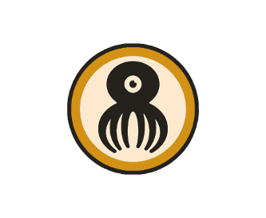

# Sidebets

We often set out to form productive and healthy habits, only to fall short. There's different literature and science around exactly how long it takes to form a habit--21 days is thrown around a lot. It's probably close to correct.

21 days is exactly 3 weeks. 3 sets of 7 days. Why not make it easier and break it down into sets of 7 days? If that sounds scary, then how about doing one thing tomorrow? [Negotiate with yourself. Don't be tyrannical.](https://www.youtube.com/watch?v=9vk64cQmva0)

#### Pick a challenge, and a time period, and do it. Some examples of challenges:

 - Meditate at least once every day.
 - Run 15K in a week.
 - Do 100 push-ups every day.
 - Finish a book in a week.
 - Do a certain amount of focused productivity on a task. 

And hold yourself accountable. Get some skin in the game, raise the stakes. Make a **side bet**. Pick your "punishment". Or if that word is too harsh or negative for you, then how about thinking of it as a deposit on improving your life?

#### Some examples of deposits:

 - Money. Preferably in the form of cryptocurrency. Any meaningful amount that has a little sting.
 - Doing something embarrassing. Perhaps recording yourself singing a song. 
 
### How to participate
  
 - [ ] Join the Telegram [SIDEBETS](tg://join?invite=H7Tv8g1lCtWleCZk7PmaLA) room.
 - [ ] Pick an activity, or set of activities.
 - [ ] Tell the group both your goals and the accompanying punishments.
 - [ ] Track your activities if possible using an App.
	- Meditation? How about [Oak](https://www.oakmeditation.com/)
	- Exercise? We like [Fitbod.](https://www.fitbod.me/)
	- Running? [Runkeeper](https://runkeeper.com/) is always a solid choice.
	- Flossing every day? [Don't break the chain.](https://itunes.apple.com/us/app/dont-break-the-chain/id313567772)
	- Focused productivity? Grow some trees with [Forest.](https://www.forestapp.cc/en/)
	- Diet? You have a friend in [Myfitnesspal](https://www.myfitnesspal.com/)

Then each day, simply hold yourself accountable by checking in with the group on your progress. Share proof of your activity in the form of screenshots or photos.

### FAQ
Q: Where does the money go if I have to pay a monetary punishment?
A: For now, all cryptocurrency deposits go into a shared wallet. This wallet will be used to fund business ideas, fun activities, possibly steak a reward pool. The bottom line is the money will be used to benefit the group.
